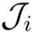
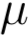

# Picard-Lefschetz Integrator
Oscillatory integrals, such as the ones occurring in optical interference phenomena, are central to physics. These integrals are however often expensive to evaluate numerically. Picard-Lefschetz theory can be used to transform analytic oscillatory integrals into sums of convex integrals by deforming the integration domain in the complex plane. In the paper <a href="url">Feldbrugge, Pen and Turok, 2019</a>, we propose a new numerical integrator, which enables us the efficiently evaluate the interference effects near caustics in lenses. We here present corresponding code for the one-dimensional integral. The code serves as a proof of concept and is not optized. Different applications might require different implementations.

## Picard-Lefschetz theory ##
We illustrate the technique by studying the one-dimensional example

<a href="https://www.codecogs.com/eqnedit.php?latex=\Psi(\mu,\nu)&space;=&space;\sqrt{\frac{\nu}{\pi}}&space;\int&space;e^{i\phi(x;\mu)\nu)}\mathrm{d}x" target="_blank"></a>

with the exponent

<a href="https://www.codecogs.com/eqnedit.php?latex=i\phi(x;\mu)\nu&space;=&space;i&space;\left[(x-\mu)^2&space;&plus;&space;\frac{\alpha}{1&plus;x^2}&space;\right&space;]\nu" target="_blank"></a>

with the strength of the lense <a href="https://www.codecogs.com/eqnedit.php?latex=\alpha" target="_blank"></a>, the frequency <a href="https://www.codecogs.com/eqnedit.php?latex=\nu" target="_blank"></a>, as a function of <a href="https://www.codecogs.com/eqnedit.php?latex=\mu" target="_blank"></a>. 

Using Picard-Lefschetz theory we can express the integral as a sum of convex integrals along the steepest descent contours  of the exponent, i.e.,

<a href="https://www.codecogs.com/eqnedit.php?latex=\Psi(\mu;\nu)&space;=&space;\sqrt{\frac{\nu}{\pi}}&space;\sum_i&space;\int_{\mathcal{J}_i}e^{i\phi(x;\mu)\nu}\mathrm{d}x" target="_blank"></a>

The evaluation of the integral is thus reduced to the finding the relevant steepest descent contours. We first expand the exponent into a real and an imaginary part

<a href="https://www.codecogs.com/eqnedit.php?latex=i\phi(x;\mu)=h(x;\mu)&space;&plus;&space;i&space;H(x;\mu)" target="_blank"></a>

The downward flow, corresponding to the real part of the exponent, is defined as 

<a href="https://www.codecogs.com/eqnedit.php?latex=\frac{\partial&space;\gamma_\lambda(x)}{\partial&space;\lambda}=-\nabla_x&space;h[\gamma_\lambda(x)]" target="_blank"></a>

with the boundary condition

<a href="https://www.codecogs.com/eqnedit.php?latex=\gamma_0(x)=x&space;\in&space;\mathbb{C}" target="_blank"></a>

The flow induces a deformation of the original integration domain <a href="https://www.codecogs.com/eqnedit.php?latex=\mathbb{R}" target="_blank"></a> to

<a href="https://www.codecogs.com/eqnedit.php?latex=X_\lambda&space;=&space;\gamma_\lambda(\mathbb{R})&space;\subset&space;\mathbb{C}" target="_blank"></a>

which, in the limit of large <a href="https://www.codecogs.com/eqnedit.php?latex=\lambda" target="_blank"></a>, approaches the thimble 

<a href="https://www.codecogs.com/eqnedit.php?latex=\lim_{\lambda\to\infty}X_\lambda&space;=&space;\mathcal{J}" target="_blank"></a>

The deformation for <a href="https://www.codecogs.com/eqnedit.php?latex=\mu=0" target="_blank"></a> is illustrated in the figure


where the red points are the saddle points, the black curves are the steepest descent and ascent contours eminated by the saddle points, the blue curve is the deformed integration domain consisting of a number of line segments and the grey areas are the regions for which the real part of the exponent is smaller than a threshold. Along the thimble, the evaluation of the integral is trivial as the integrand is convex. 

The resulting interference pattern consists of a single image region in which the intensity is small, a triple-image region in which the intensity oscillates and two fold caustics separating the single- and triple-image regions.


For more details see the paper <a href="url">Feldbrugge, Pen and Turok, 2019</a> and the wiki.

## Implementation ##
The code is written in C++. The implementation relies only the standard libraries. Compile the code with

```console
$ g++ main.cpp -o PicardLefschetz.a
```

Evaluate the integral described above by running the executable 

```console
$ ./PicardLefschetz.a
```

The program outputs the binary files "simplices#.bin" consisting the of the line-segments in the thimble, and "psi#.bin" consisting of the integral for various . For more information see the wiki.

## Collaborators ##

* Job Feldbrugge
* Neil Turok 
* Ue-Li Pen
